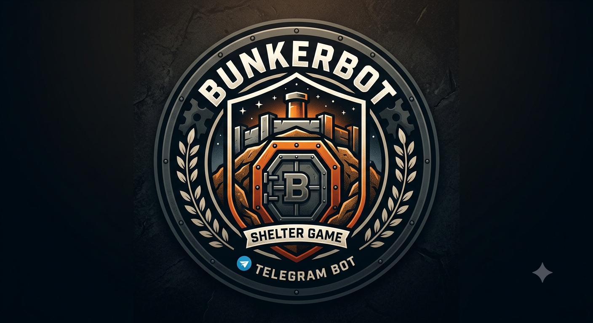

# **🌋 BunkerBot — Telegram Game Bot**



**BunkerBot** is a feature-packed Telegram implementation of the popular psychological party game **"Bunker" (Бункер)** written in Python using **Aiogram 3** and managed with **uv**.

## **📌 About The Game**

An apocalypse has hit the Earth\! A limited number of seats are available in the fallout shelter. Players receive randomized characters with unique traits, health conditions, baggage, special abilities, and secret facts. Through multiple discussion and voting rounds, players must decide who deserves a spot in the bunker to rebuild humanity.

## **✨ Key Features**

* 🎮 **Room Management & Deep Linking:** Quick room creation with customized player capacity and bunker seats. Easy one-click invite links via Telegram deep-linking.  
* 📊 **Live Real-time Dashboard:** Asynchronous, concurrent state updates (asyncio.gather) that dynamically edit player dashboards without spamming chat.  
* 🎭 **Rich Character Generation:**  
  * 30+ Special Active Abilities *(Sabotage, Swaps, Biological Warfare, Shields, Amnesty, etc.)*.  
  * 25+ Unique Exit Conditions / Wills *(Plagues, Curses, Bribes, Gas Attacks upon exile)*.  
  * Diverse professions, health conditions, traits, hobbies, baggage, and facts.  
* 🗳️ **Interactive Voting Mechanics:** Secret weighted voting with support for double votes, immunity shields, vote reflection, and ties.  
* 🧬 **Smart Automated Endgame Evaluation:** Calculates survival probability based on apocalypse demands, required specialist skills, health ratios, and demographic repopulation capability (fertile gender/age ratios).

## **🛠️ Tech Stack**

* **Language:** Python 3.10+  
* **Framework:** [Aiogram 3.x](https://github.com/aiogram/aiogram) (Asynchronous Telegram Bot API)  
* **Package Manager:** [uv](https://github.com/astral-sh/uv) (Extremely fast Python package installer and resolver)  
* **Storage:** In-Memory FSM Storage  
* **Environment:** python-dotenv

## **🚀 Quick Start & Installation**

### **Prerequisites**

* Python 3.10 or higher  
* [uv](https://docs.astral.sh/uv/getting-started/installation/) installed (curl \-sSf https://astral.sh/uv/install.sh | sh or brew install uv)  
* A Telegram Bot Token from [@BotFather](https://t.me/BotFather)

### **Setup Instructions**

1. **Clone the repository:**  
   ```git clone https://github.com/PiterPentester/BunkerBot.git && cd BunkerBot```

2. **Create environment and sync dependencies with uv:**  
   ```uv sync```

3. **Configure Environment Variables:**  
   Create a .env file in the root directory
   ```TG\_API\_TOKEN=your_telegram_bot_token_here```

4. **Run the Bot:**  
   ```uv run bunker_bot.py```

## **🎮 How to Play**

1. **Start the Bot:** Send /start to the bot on Telegram.  
2. **Create a Game:** Click **"Створити гру 🎲"** and set total players and bunker seats.  
3. **Invite Friends:** Share the generated invite link with your group.  
4. **Game Loop:**  
   * **Reveal Characteristics:** Unveil attributes to persuade others of your value.  
   * **Use Actions:** Play special action cards to turn the tables in your favor.  
   * **Vote:** Cast votes on who should be exiled from the shelter.  
5. **Final Evaluation:** Once the remaining players fit inside the bunker, the system automatically evaluates whether humanity survives the apocalypse\!

## **📁 Repository Structure**


BunkerBot/  
├── bunker\_bot.py       \# Main bot handler, state machine & UI flow  
├── game\_data.py        \# Card datasets, character generator & survival evaluation logic  
├── pyproject.toml      \# Modern Python project configuration for uv  
├── .env.example        \# Example environment configuration  
└── README.md           \# Project documentation
